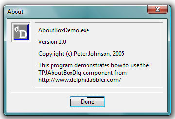

# [About Box Component](../index.md) Overview 

## Description

> This page provides an overview of the features of the About Box Component. If you are looking for information on programming with the component please see the [Programmers' Guide](./API.md).

This project provides a single non-visual component, [_TPJAboutBoxDlg_](./API/TPJAboutBoxDlg.md) that encapsulates an "About" dialogue box.

When displayed the about box appears like this:

 -- _screen shot taken on Windows Vista_

The text displayed in the about box can be set using properties exposed by the component, or can be extracted from version information using a linked DelphiDabbler _Version Information Component_.

The dialogue's position can be specified relative to the screen, desktop or parent application. There is a single close button whose appearance and position can be customised. The about box also displays the program's icon. Finally, the dialogue box's font can be altered.

### Required component

In order to compile, _TPJAboutBoxDlg_ requires that a DelphiDabbler [_Version Information Component_](../../VerInfo/index.md) is installed.

### Demo program

A demo program is available that can be used to exercise the component.

## Compatibility

The component is believed to compile with any Delphi compiler from Delphi 2 through to 11.3. It is compatible with 32 bit and 64 bit Windows targets.

This is a VCL component and so is not compatible with the FireMonkey framework.

The component not suitable for compilation on platoforms other than Windows.

## Links

* [Programmers' Guide](./API.md).
